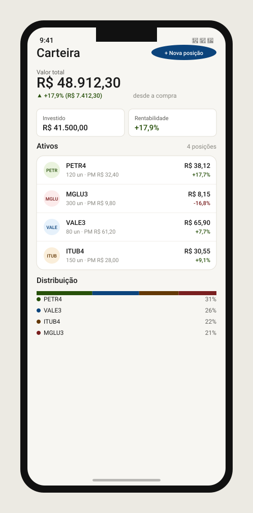
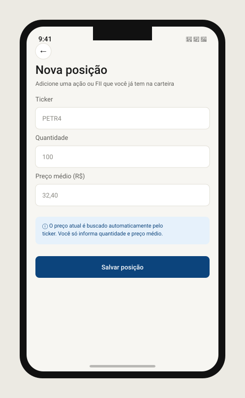

# stockapp-portfolio

Kotlin Multiplatform (KMP) + Compose Multiplatform module of [StockApp](https://github.com/dgbarreto/stockapp-app) — an investment tracking app (learning project).

Domain + data (the user's positions — ticker/quantity/average price, client for [`stockapp-backend`](https://github.com/dgbarreto/stockapp-backend), `/positions` endpoints) and Compose screens for the dashboard and portfolio.

## Screens

**Dashboard** — total value, return, metric cards, position list (with ticker logos fetched from GCS, falling back to initials) and allocation breakdown:



**Add position** — manual entry of ticker/quantity/average price:



## Structure

- `portfolio/` — the only module in this repo, targeting Android (via `com.android.kotlin.multiplatform.library`) + iOS (static framework `Portfolio`), shared code in `portfolio/src/commonMain`.
- `sample/` + `sample-android/` — dev-only sample apps (Android + Desktop) used to validate the module in isolation.

## What's in it

- **Domain/data**: `PositionsApiClient` (Ktor), `PortfolioSummary`/`PositionSummary` models, consuming the backend's `/positions/summary` endpoint, which already aggregates live price, return and ticker logo per position.
- **Presentation**: `DashboardScreen`/`DashboardViewModel` and `AddPositionScreen`/`AddPositionViewModel`, built with `stockapp-designsystem` components (`StockAppCard`, `StockAppAvatar`).

## Status

Fully implemented and integrated into `stockapp-app` (a "Portfolio" tab alongside "Quotes", with bottom navigation). Branch-protected.

**Heads up**: manual position entry (`AddPositionScreen`) is being phased out as part of the "Orders" phase — [`stockapp-orders`](https://github.com/dgbarreto/stockapp-orders) is becoming the single source of truth for the portfolio (every position will be derived from a buy/sell order history, recalculated transactionally in the backend). This module will keep owning the dashboard/read side; the manual add-position flow moves to a quick order-entry bottom sheet in `stockapp-orders`.

## Stack

- Kotlin 2.4.0 · Compose Multiplatform 1.11.1 · AGP 9.0.1 · Ktor Client

## Running

```
./gradlew :portfolio:build
./gradlew :portfolio:testAndroidHostTest
./gradlew :portfolio:iosSimulatorArm64Test
```

---

_Progress kept up to date manually as the project moves forward._
